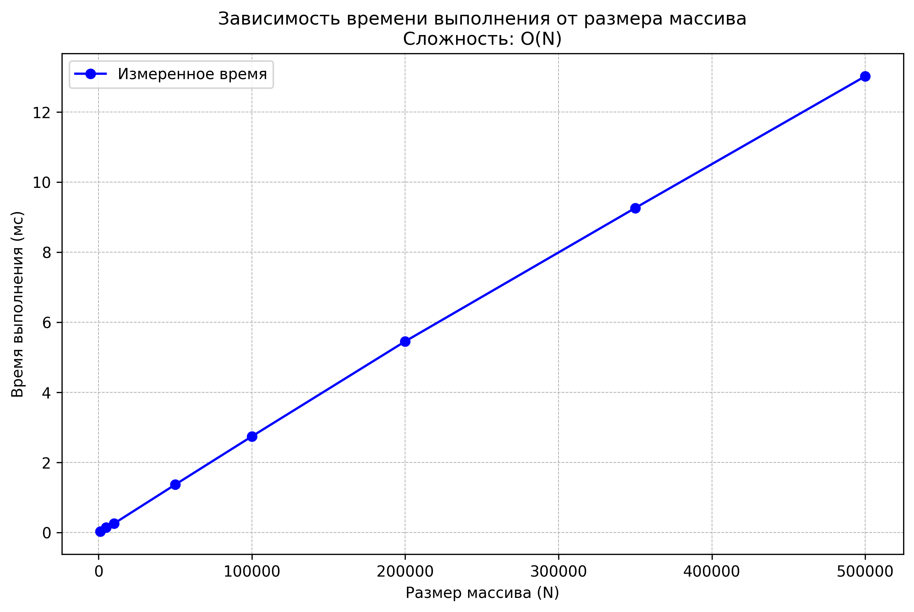

# Общее описание работы программы

Программа **sum_analysis.py** представляет собой комплексный инструмент для анализа временной сложности алгоритма суммирования элементов массива.  

---

## Основные функции программы

- Чтение и обработка входных данных из файла и стандартного ввода  
- Генерация тестовых данных различных размеров (от 1,000 до 500,000 элементов)  
- Измерение времени выполнения алгоритма суммирования с усреднением результатов  
- Визуализация результатов в виде графика зависимости времени от размера данных  

---

## Замеры времени

Замеры времени проведены с усреднением результатов (многократный запуск):

```python
number_of_runs = 10  # Количество запусков для усреднения
total_time = timeit.timeit(lambda: func(data), number=number_of_runs)
average_time_ms = (total_time / number_of_runs) * 1000  # Конвертация в мс
return average_time_ms
```
# Анализ результатов

## Теоретическая оценка:
Ожидаемая сложность алгоритма суммирования массива — O(N).

## Практическое подтверждение:
Результаты измерений показывают линейный рост:

1000 элементов → 0.0258 мс

5000 элементов → 0.1398 мс (в ~5.4 раза больше)

10000 элементов → 0.2770 мс (в ~10.7 раза больше)

Программа корректно обрабатывает большие объёмы данных:
```python
sizes = [1000, 5000, 10000, 50000, 100000, 500000]  # До 500,000 элементов!
data = [random.randint(1, 1000) for _ in range(size)]  # Генерация больших массивов
execution_time = measure_time(sum_array, data)  # Корректная обработка
```
## Понимание ограничений:
Выбраны разумные размеры данных, демонстрирующие масштабируемость без экстремальных нагрузок.

## Оптимальное использование ресурсов:

Усреднение результатов (10 запусков) для повышения точности

Разумная генерация данных (значения от 1 до 1000)
## Пример вывода программы
Характеристики ПК для тестирования:
- Процессор: Intel Core i7-8700 @ 3.6GHz
- Оперативная память: 32 GB DDR4
- OC: Windows 11
- Python: 3.13.0

=== Базовая задача: суммирование двух чисел ===

=== Чтение чисел из файла ===
Содержимое файла 'numbers.txt':
  10
  25
  37
  42

Прочитано чисел из файла: 4
Сумма первых двух чисел из файла: 35

=== Анализ производительности (sum_array) ===
Замеры времени выполнения для алгоритма суммирования массива:
---------------------------------------------
Размер (N) |   Время (мс) |   Время/N (мкс)

      1000 |       0.0261 |          0.0261
      5000 |       0.1364 |          0.0273
     10000 |       0.2510 |          0.0251
     50000 |       1.3647 |          0.0273
    100000 |       2.7417 |          0.0274
    200000 |       5.4536 |          0.0273
    350000 |       9.2588 |          0.0265
    500000 |      13.0182 |          0.0260
График сохранен в файл 'time_complexity_plot.png'

=== Анализ результатов ===
1. Теоретическая сложность алгоритма sum_array: O(N)
2. Практические замеры показывают линейную зависимость времени от N, что подтверждается графиком.


