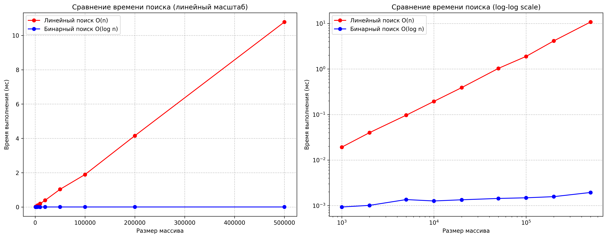

# Сравнение эффективности линейного и бинарного поиска

##  Описание проекта
Данный проект предназначен для **сравнительного анализа линейного (`O(n)`) и бинарного (`O(log n)`) поиска**.  
Скрипт измеряет время выполнения обоих алгоритмов при различных размерах массива, строит графики и делает детальный анализ результатов.

Основные этапы:
1. Реализация алгоритмов поиска.
2. Генерация тестовых данных и измерение времени выполнения.
3. Визуализация и анализ полученных результатов.

---

##  Алгоритмы

###  Линейный поиск
- Перебирает элементы массива последовательно.
- Сложность: **`O(n)`**.
- Применим к неотсортированным данным.

###  Бинарный поиск
- Работает только на отсортированном массиве.
- Делит массив пополам на каждой итерации.
- Сложность: **`O(log n)`**.

---

##  Методика эксперимента

1. **Тестовые данные**  
   - Генерируется **отсортированный массив уникальных целых чисел** случайным образом.  
   - Для поиска выбираются разные варианты целей:
     - первый элемент,
     - последний элемент,
     - средний элемент,
     - отсутствующий элемент.  
   Такой выбор позволяет оценить поведение алгоритмов в разных сценариях:
   - линейный поиск может завершиться как быстро (при нахождении первого элемента), так и максимально долго (поиск последнего);
   - бинарный поиск всегда работает примерно за одинаковое время, независимо от позиции элемента.

2. **Измерения**  
   - Время выполнения усредняется по **100 запускам** для уменьшения случайных колебаний.
   - Используется модуль `timeit`, измерение идёт в миллисекундах.

3. **Размеры массивов**  
   - Эксперименты проводятся для массивов от `1000` до `500000` элементов.  
   - Это позволяет проследить динамику роста времени и сравнить теорию с практикой.

---

##  Результаты

1. **Теоретическая сложность**  
   - Линейный поиск: `O(n)`  
   - Бинарный поиск: `O(log n)`

2. **Практика подтверждает теорию**  
   - Время линейного поиска растёт примерно пропорционально размеру массива.  
   - Время бинарного поиска увеличивается очень медленно, что соответствует логарифмическому росту.

3. **Сравнение эффективности**  
   - На больших массивах бинарный поиск оказывается быстрее линейного.  
   - Например, для массива на 500 000 элементов бинарный поиск значительно быстрее.

---
Размеры времени выполнения (среднее по 100 запускам):
---------------------------------------------
     Размер | Линейный (мс) | Бинарный (мс) | Отношение
       1000 |       0.0171 |       0.0009 |     18.2x
       2000 |       0.0371 |       0.0011 |     33.1x
       5000 |       0.0936 |       0.0012 |     78.2x
      10000 |       0.1926 |       0.0012 |    154.4x
      20000 |       0.3833 |       0.0014 |    283.0x
      50000 |       1.1104 |       0.0014 |    771.6x
     100000 |       1.9949 |       0.0016 |   1284.9x
     200000 |       4.2655 |       0.0016 |   2708.2x
     500000 |      11.0120 |       0.0017 |   6573.4x

##  Визуализация

Скрипт сохраняет графики в файл `search_comparison.png`.

1. **Линейный масштаб**  
   Показывает реальные времена работы.  
   Линейный поиск растёт «стеной вверх», бинарный остаётся почти плоским.

2. **Логарифмический масштаб (log-log scale)**  
   - На оси X и Y применён логарифмический масштаб.  
   - Линейный поиск отображается как почти прямая линия с наклоном ~1 (подтверждение `O(n)`).  
   - Бинарный поиск — пологая линия, близкая к горизонтали (подтверждение `O(log n)`). 
  
 

